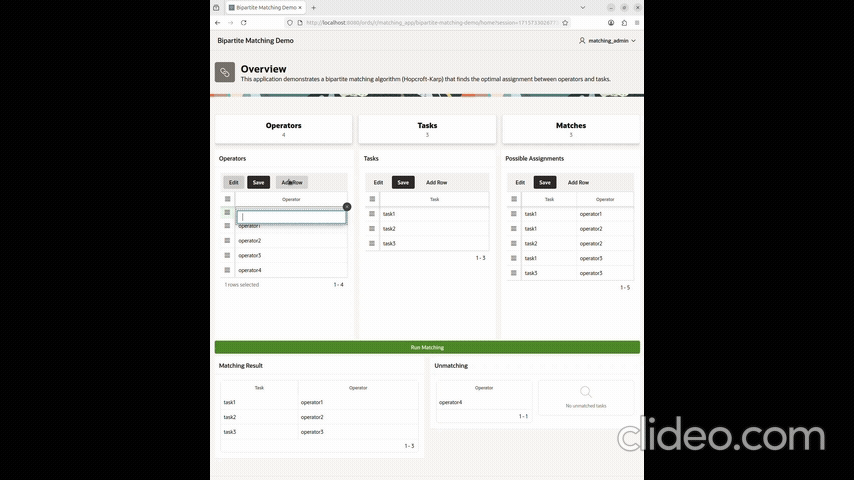

# Bipartite Matching

<p align="center">
  
</p>

- To set up the application step-by-step, follow this guide:
[Full Setup Instructions](app/instructions.MD)

**Bipartite matching** finds the largest set of edges that pair nodes from two disjoint sets without overlap.
This project implements the **Hopcroft-Karp algorithm**, which efficiently finds maximum matchings in bipartite graphs using BFS and DFS.

The algorithm is implemented using a Java Stored Procedure named *matching*, and it is exposed as a table function that accepts a cursor as input parameter:

```sql
select * 
from table(
       matching(
          cursor(
            select task, operator
            from graph_table(g
              match (t is task)-[e is is_assigned]->(o is operator)
              columns (t.id as task, o.id as operator)
           )
        )
    )
);
```


---

## 🚀 Getting Started

You can quickly get an image of Oracle Graph Server (using Podman):

- [Oracle Container Registry](https://container-registry.oracle.com)  Go to **Database > free (23ai)**

```sh
podman run --name oracle32aifree -p 1521:1521 -e ORACLE_PWD=password container-registry.oracle.com/database/free:latest
```

Run the script [`hopcroftkarp.sql`](hopcroftkarp.sql) using `sqlcl` or `sqlplus`.

---

## 📋 Sample Data

**Operators:**  
`o1`, `o2`, `o3`

**Tasks:**  
`t1`, `t2`, `t3`

**Relationships:**  
- `o1` → `t1`, `t2`, `t3`  
- `o2` → `t2`  
- `o3` → `t3`

---

## 🎯 Graphical Representation

```text
o1── t1
 │
 ├── t2
 │
 └── t3
o2 ── t2
o3 ── t3
```

---

## ✅ With Hopcroft-Karp Algorithm

```text
o1 ── t1
o2 ── t2
o3 ── t3
```
